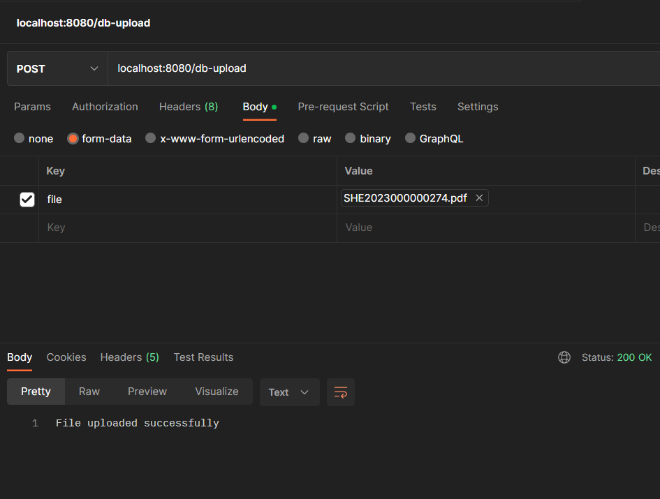

# Spring File Upload

A Spring Boot project with file upload functionality to both local storage and a database.

## Table of Contents

- [Technologies Used](#technologies-used)
- [Setup and Installation](#setup-and-installation)
- [Usage](#usage)
- [Contributing](#contributing)
- [License](#license)

## Technologies Used

- [Spring Boot](https://spring.io/projects/spring-boot)
- [Spring Web](https://docs.spring.io/spring-framework/docs/3.2.x/spring-framework-reference/html/mvc.html)
- [Spring Data JPA](https://spring.io/projects/spring-data-jpa)
- [H2 Dtabase](https://www.h2database.com/html/main.html)

## Setup and Installation

To run this project, you will need to have Java 17.

#### Maven

<b>1 )</b> Download your project from this link shown below
```
    git clone https://github.com/Eukolos/spring-file-upload.git
```

<b>2 )</b> Go to the project's home directory shown below
```
    cd spring-file-upload
```

<b>3 )</b> Create native image though this command shown below
```
    mvn spring-boot:run
 ```   
## Usage

### Upload a Pdf to DB

```
POST /db-upload
Accept: multipart/form-data
Content-Type: multipart/form-data
{
example.pdf
}
RESPONSE: HTTP 200 (OK)
Response-Type: String
Location header: http://localhost:8080/db-upload
```

### Upload a Pdf to Local
```
POST /local-upload
Accept: multipart/form-data
Content-Type: multipart/form-data
{
example.pdf
}
RESPONSE: HTTP 200 (OK)
Response-Type: String
Location header: http://localhost:8080/local-upload
```

### Download a Pdf from Db
```
Get /db-download?name=example.pdf
RESPONSE: HTTP 200 (OK)
Response-Type: multipart/form-data
Location header: http://localhost:8080/db-download?name=example.pdf
```

### Download a Pdf from Local
```
Get /local-download?name=example.pdf
RESPONSE: HTTP 200 (OK)
Response-Type: multipart/form-data
Location header: http://localhost:8080/local-download?name=example.pdf
```


### Upload a Pdf to Local with Postman


### Upload a Pdf to Db with Postman


## Contributing

This project was created by [Eukolos](https://github.com/Eukolos). Contributions are welcome! 
